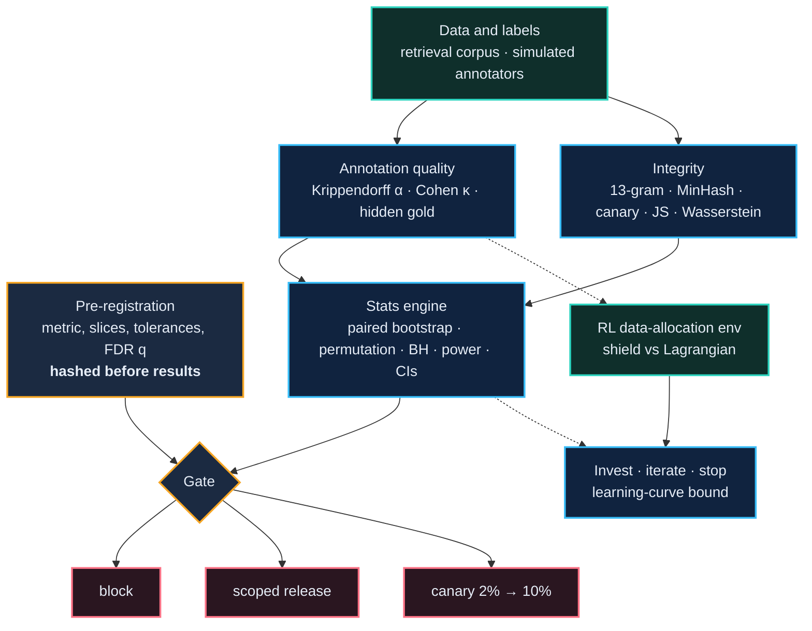

<div align="center">


<br/>


**Before you trust a number, ask whether the signal behind it deserves it.**

</div>

---

## The idea in one minute

A leaderboard goes up. A reward curve climbs. Two annotators agree. Each of these is *a signal*, and each can mislead:
the average hides a regressed slice, the right document is retrieved but ranked second, the agreement comes from
annotators copying each other, the reward is being gamed.

SignalGate is a small, tested codebase that **decides what a signal is allowed to claim**: it freezes the rules before
looking at results, judges changes with confidence intervals instead of point estimates, calibrates the humans (here:
simulated ones) who produce labels, and ends in one of three outcomes: **block**, **scoped release**, or **canary**.

> [!IMPORTANT]
> Everything that looks like data here (annotators, labels, documents, model scores) is **generated by code in this
> repository**. Nothing is human data, client data, or output from a real model. The point is the *method*, and every
> number below is regenerated from code (see [Run it](#run-it)).

### Four results, each reproducible

| | What happened | The number |
|---|---|---|
| **Gate** | Overall accuracy rose, but one critical slice fell. The gate blocked the release. | overall **@@core|gate.overall.mean_diff|+.3f@@**, critical slice **@@core|gate.slices.1.mean_diff|+.3f@@** → `BLOCK` |
| **Retrieval** | The authoritative document is retrieved, yet rarely ranked first. A metadata-aware re-ranker closes most of the gap. | recall@10 **@@core|retrieval.BM25.recall@10.0|.2f@@**, Success@1 **@@core|retrieval.BM25.success@1.0|.2f@@** → **@@core|retrieval.BM25 + authority.success@1.0|.2f@@** |
| **Annotation** | Agreement jumps when annotators copy each other, while the consensus label gets worse. | alpha **@@ann|honest.alpha_mean|.2f@@** → **@@ann|herding.alpha_mean|.2f@@**, consensus accuracy **@@ann|honest.consensus_accuracy_mean|.2f@@** → **@@ann|herding.consensus_accuracy_mean|.2f@@** |
| **Reward hacking** | Rewarding agreement makes an RL agent buy labels from a herding vendor almost every time. | **@@rl|E2/proxy_agreement/train/ep_vendor_steps/0|.1f@@** of ~24 batches; true gain **@@rl|E2/proxy_agreement/train/ep_gain/0|.2f@@** vs **@@rl|E2/true_gain/train/ep_gain/0|.2f@@** |

---

## How it fits together



---

## 1. The gate: a better average is not a decision


Rules are written down **first** and hashed. If anyone loosens them after seeing data, the gate refuses to run.

```python
import numpy as np
from sgate_eval.gate import PreRegistration, SliceSpec, run_gate

reg = PreRegistration(
    primary_metric="accuracy",
    slices=[SliceSpec(name="general"),
            SliceSpec(name="medical", critical=True, tolerance=0.01),
            SliceSpec(name="chitchat")],
    fdr_q=0.05, min_effect=0.005,
)
recorded = reg.fingerprint()                       # store this BEFORE running the eval

report = run_gate(reg, overall=(cand_all, base_all),
                  per_slice={"general": (c1, b1), "medical": (c2, b2), "chitchat": (c3, b3)},
                  registered_hash=recorded)
print(report.to_markdown())                        # decision, reasons with numbers, next step
```

| Outcome | When it fires |
|---|---|
| **block** | A critical slice **breaches** (even the optimistic end of its interval is worse than its tolerance), *or* the overall gain is not confirmed (lower bound below the minimum effect). |
| **scoped release** | The overall gain is confirmed, but non-critical slices regressed. Ship without them, fix them next. |
| **canary** | Gain confirmed, no regression. Widen traffic in steps (2% → 10%) with rollback triggers written in advance. Under-powered slices keep it here. |

<details>
<summary><b>Why these statistical choices</b></summary>

* **Paired resampling.** Candidate and baseline score the same items, so item difficulty cancels. Bootstrap gives the interval, a sign-flip permutation test the p-value.
* **Benjamini-Hochberg across slices.** At 40 slices and alpha 0.05 you expect about two false alarms by chance. BH controls their expected share among the slices it flags; it does not remove them.
* **Decide on the interval.** Point estimates hide uncertainty. A drop only counts when it clears the pre-registered tolerance.
* **Exact bounds for rare failures.** Clopper-Pearson and the rule of three: "0 failures in 100" means "below about 3%", never "safe".
* **Power and minimum detectable effect** are computed so a null result is not mistaken for "no effect".
* Full list and the limits of each choice: [docs/DESIGN.md](docs/DESIGN.md).
</details>

---

## 2. Retrieval: found is not the same as first


A synthetic corpus gives every topic an **authoritative** document, a **superseded** older version, and forum distractors
that repeat the old value. Relevance is graded (authoritative = 2, superseded = 1, other = 0), so NDCG rewards putting the
current document above the stale one, and **Success@1** asks the question users actually care about.

* Lexical rankers (BM25, TF-IDF, rank fusion) retrieve the authoritative page every time within the top ten and still put it first only **@@core|retrieval.BM25.success@1.0|.0%@@** to **@@core|retrieval.TF-IDF.success@1.0|.0%@@** of the time.
* A re-ranker that uses (noisy, 90% reliable) status metadata reaches **@@core|retrieval.BM25 + authority.success@1.0|.0%@@**. Its weight was chosen on a **separate dev corpus**, not on the numbers shown.
* Sweep on the test corpus: past a weight of 0.3, recall@10 starts to fall (@@core|authority_weight_sweep.4.recall@10|.2f@@ at weight 0.5, @@core|authority_weight_sweep.5.recall@10|.2f@@ at 1.0), likely because boosts from wrong metadata can displace the right page. A gain at one rank can cost at another.

> [!NOTE]
> Recall@10 is easy by construction here (only four candidate documents per topic), and the suite has no neural dense retriever, so it says nothing about how such models behave. It demonstrates the *metric design*.

---

## 3. Annotation: agreement is necessary, not sufficient

* **Krippendorff's alpha** (nominal, ordinal, interval; missing data) and **Cohen's kappa**. The implementation reproduces the textbook example (0.743 nominal, 0.849 interval).
* A **calibration gate** (default alpha ≥ 0.7) says either *scale up* or *rewrite the guideline*.
* A **hidden-gold audit** flags an annotator only when the *upper* Wilson bound on their accuracy is below the bar, so small samples never produce accusations.
* **Why agreement alone can't be trusted:** over 20 simulated runs, letting annotators copy each other moved alpha from **@@ann|honest.alpha_mean|.2f@@** to **@@ann|herding.alpha_mean|.2f@@** while consensus accuracy dropped from **@@ann|honest.consensus_accuracy_mean|.2f@@** to **@@ann|herding.consensus_accuracy_mean|.2f@@**.

Leakage and drift live next to it: 13-gram overlap, MinHash Jaccard, canary strings (which only *detect*), Jensen-Shannon for category mixes, Wasserstein for continuous values.
The tests assert the honest limit too: **a paraphrase evades every lexical detector**.

---

## 4. A constrained-RL environment for spending a labelling budget

An agent buys labels in batches: **3 domains × 4 annotator tiers × 3 batch sizes** (plus STOP). Labels improve a simulated model with diminishing returns.
A batch **violates the quality gate** if its measured alpha is below 0.7 or, with the audit on, its accuracy on hidden gold items is below 0.8.
Tier 4 is a cheap bulk vendor whose annotators copy each other: very high agreement, low true accuracy.


Five seeds per method, 95% t-intervals, PPO on CPU (about @@rl|steps|,@@ environment steps each).

| | Gain (train pool) | Violations / episode (train) | Gain (held-out pool) | Violations / episode (held-out) | Gain lost on held-out |
|---|---|---|---|---|---|
| PPO, no constraint | **@@rl|E1/unconstrained/train/ep_gain/0|.3f@@** | @@rl|E1/unconstrained/train/ep_violations/0|.1f@@ | @@rl|E1/unconstrained/heldout/ep_gain/0|.3f@@ | @@rl|E1/unconstrained/heldout/ep_violations/0|.1f@@ | @@gap|E1/unconstrained|.0%@@ |
| PPO + **shield** (rule-based masking) | @@rl|E1/shield/train/ep_gain/0|.3f@@ | **@@rl|E1/shield/train/ep_violations/0|.2f@@** | @@rl|E1/shield/heldout/ep_gain/0|.3f@@ | **@@rl|E1/shield/heldout/ep_violations/0|.2f@@** | @@gap|E1/shield|.0%@@ |
| PPO + **Lagrangian** (CMDP, budget 0.5) | @@rl|E1/lagrangian/train/ep_gain/0|.3f@@ | **@@rl|E1/lagrangian/train/ep_violations/0|.2f@@** | @@rl|E1/lagrangian/heldout/ep_gain/0|.3f@@ | @@rl|E1/lagrangian/heldout/ep_violations/0|.2f@@ | @@gap|E1/lagrangian|.0%@@ |
| Hand-written rule of thumb | @@rl|baseline/heuristic/train/ep_gain/0|.3f@@ | @@rl|baseline/heuristic/train/ep_violations/0|.2f@@ | @@rl|baseline/heuristic/heldout/ep_gain/0|.3f@@ | @@rl|baseline/heuristic/heldout/ep_violations/0|.2f@@ | n/a |
| Random | @@rl|baseline/random/train/ep_gain/0|.3f@@ | @@rl|baseline/random/train/ep_violations/0|.1f@@ | @@rl|baseline/random/heldout/ep_gain/0|.3f@@ | @@rl|baseline/random/heldout/ep_violations/0|.1f@@ | n/a |

### What the experiment actually says

1. **Ignoring the constraint nearly doubles the gain and breaks the gate about @@rl|E1/unconstrained/train/ep_violations/0|.0f@@ times per episode.** Obeying the gate has a real price in gain.
2. **Both constrained methods stay near the budget on the training pool**, but they do **not** clearly beat a hand-written rule of thumb on gain (@@rl|E1/shield/train/ep_gain/0|.3f@@ and @@rl|E1/lagrangian/train/ep_gain/0|.3f@@ against @@rl|baseline/heuristic/train/ep_gain/0|.3f@@). The shield is a small edge; the Lagrangian agent is roughly equal. Random buying reaches a similar gain (@@rl|baseline/random/train/ep_gain/0|.3f@@) but breaks the gate @@rl|baseline/random/train/ep_violations/0|.1f@@ times per episode, so what the constrained agents really buy is **the same gain with the gate respected**. A learned policy is not automatically worth its complexity.
3. **Under distribution shift, neither one held the budget** (@@rl|E1/shield/heldout/ep_violations/0|.2f@@ for the shield, @@rl|E1/lagrangian/heldout/ep_violations/0|.2f@@ for the Lagrangian, against 0.5). I expected the learned constraint to adapt better. In this setup it did not. A plausible reason, which I did not test, is that the shield's "stop using a tier that just failed" rule reacts within an episode, while the multiplier was tuned only on the original pool.
4. **A "hard" shield still shows violations, and the cause is measurement noise.** The gate statistic is computed on a finite batch. The diagnostic simulates batches the shield *allows*, shown in the table directly below.

@@diag@@

Small batches fail the gate by chance even when the annotators are good, so a guarantee about the *expected* quality is not a guarantee about the *measured* quality.

5. **Reward hacking reproduces.** With agreement-volume as the reward (and the gold audit off during training), the agent bought from the herding vendor in **@@rl|E2/proxy_agreement/train/ep_vendor_steps/0|.1f@@** of ~24 batches, scored **@@rl|E2/proxy_agreement/train/ep_proxy/0|.1f@@** on its own reward against **@@rl|E2/true_gain/train/ep_proxy/0|.1f@@** for the true-gain agent, and delivered **@@rl|E2/proxy_agreement/train/ep_gain/0|.2f@@** true gain against **@@rl|E2/true_gain/train/ep_gain/0|.2f@@**.


<details>
<summary><b>Training dynamics</b></summary>


The multiplier rises while violations exceed the budget, then slowly relaxes. It had not fully settled by the end of training, so the Lagrangian numbers are those of a *not-yet-converged* run. A longer schedule is an obvious next experiment.
</details>

> [!WARNING]
> All RL numbers come from the simulator in [`src/sgate_eval/rl/env.py`](src/sgate_eval/rl/env.py). They compare *methods under stated assumptions*, not how a real labelling programme would behave.

---

## 5. Where to invest, iterate, or stop

`sgate_eval.decision.recommend` fits a saturating learning curve, bootstraps the predicted gain from buying more data, and applies a pre-set rule to the **lower bound**:
**invest** if even the pessimistic gain is worth it, **stop** if even the optimistic gain is not, **iterate** (fix labels or task design first) when the curve is too noisy to say.

Other pieces: failure-slice discovery (Fisher exact test per attribute value, BH-corrected, ranked by risk ratio), judge validation (position and verbosity bias, kappa against trusted labels; tested with *simulated* judges), a SQLite results registry, and a held-out regression suite that flags items that were fixed and are failing again.

---

## What each responsibility maps to

<details>
<summary><b>The nine responsibilities this repo is organised around</b></summary>

| # | Responsibility | Where it lives |
|---|---|---|
| 1 | Own evaluation end to end: framing, data design, calibration, signal validation | `gate/`, `stats/` |
| 2 | Data systems: task definitions, schemas, rubrics, incentives | `retrieval/corpus.py`, `annotation/`, `rl/env.py` |
| 3 | Failure analysis and edge cases | `analysis/failure_slices.py`, `buried` metric |
| 4 | Ambiguous behaviour → evaluation frameworks and new data categories | `retrieval/` |
| 5 | Calibrate quality early and keep raising the bar | `annotation/quality.py` |
| 6 | Iterate rapidly | `registry.py`, `cli.py`, resumable `rl/experiments.py` |
| 7 | Act as a quality gate | `gate/decision.py` |
| 8 | Credible narratives for other teams | `GateReport.to_markdown()` |
| 9 | Invest, iterate, or stop | `decision/investment.py`, `rl/` |

Longer version with reasoning: [docs/DESIGN.md](docs/DESIGN.md).
</details>

---

## Run it

```bash
git clone https://github.com/willy410-hub/SignalGate && cd SignalGate
pip install -e ".[dev,rl,viz]"      # CPU only, no accounts, no API keys

sgate demo                          # a gate report on synthetic scores
pytest -q                           # @@meta|tests@@ tests

make figures                        # redraw every chart from code
make results                        # re-run all 25 RL training runs (about 30-60 min on 2 CPU cores)
```

<details>
<summary><b>Repository layout</b></summary>

```text
src/sgate_eval/
├── gate/          pre-registration (hashed), block / scoped release / canary
├── stats/         paired bootstrap, permutation, Benjamini-Hochberg, power, CIs
├── annotation/    Krippendorff alpha, Cohen kappa, hidden gold, simulated annotators
├── integrity/     13-gram, MinHash, canary strings, Jensen-Shannon, Wasserstein
├── retrieval/     synthetic authority corpus, BM25 / TF-IDF / RRF / re-rank, NDCG, Success@1
├── analysis/      failure-slice discovery
├── judge/         position and verbosity bias, agreement with trusted labels
├── decision/      invest / iterate / stop from a learning curve
├── rl/            gymnasium environment, masked PPO, shield, Lagrangian, experiments
├── registry.py    SQLite run registry + regression suite
└── cli.py         `sgate demo`, `sgate gate`
scripts/           every figure is generated here, from results/*.json
results/           raw outputs behind every number in this README
tests/             @@meta|tests@@ tests
```
</details>

---

## What this is not

* **Not human data.** No real annotators, no client content. `annotation/simulate.py` exists to exercise the agreement code and drive the RL environment.
* **Not a model benchmark.** No language model is called; judge checks use simulated judges with known biases.
* **Not evidence about production systems.** The retrieval suite is lexical plus a metadata re-ranker; the RL results come from my simulator.
* **Defaults are defaults.** Alpha 0.7, q 0.05, tolerances and canary steps are demonstration values to be set per task with domain experts.
* **BH assumes independence or positive dependence.** Heavily overlapping slices break that assumption.

<div align="center"><sub>MIT licensed · built to be read, run, and argued with</sub></div>
